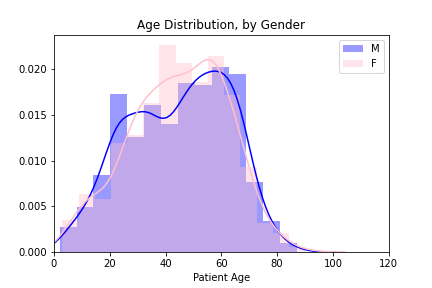
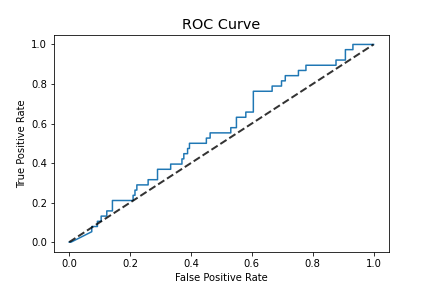
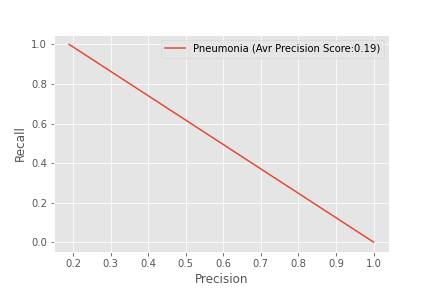
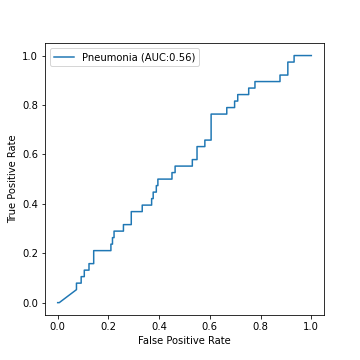
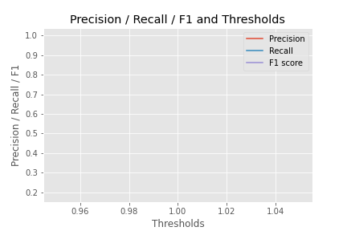

# FDA  Submission

**Your Name:**
Elizabeth Bradley

**Name of your Device:**
Pneumonia Detection Assistant

## Algorithm Description 

### 1. General Information

**Intended Use Statement:** 
This algorithm is used to assist radiologists in detecting pneumonia in a chest x-ray.

**Indications for Use:**
Algorithm can be used to screen both male and female patients. Patients may present other diseases such as Atelectasis, Cardiomegaly, Consolidation, Edema, Effusion, Emphysema, Fibrosis, Hernia, Infiltration, Mass, Nodule, Pleural_Thickening, Pneumonia, Pneumothorax which are more or less comorbid with pneumonia.

**Device Limitations:**
Ideadly, this application should be run on a GPU enabled workspace locally or in the cloud. Also, it is important to know that the algorithm is not 100% accurate and thus should not be soley used as diagnostic device. It is merely a supplementary tool to assist and streamline the radiologist workflow.

**Clinical Impact of Performance:**
The clinical impact is to improve efficiencies especially in low income areas of the world by reducing time to verfication of pneumonia diagnoses. Runtime is under a second per diagnosis which is significantly faster than most radiologists.

The algorithm attempts to minimize false and thus is more likly to predict a false positive. 

False positive indicate the presence of pneumonia. All positive reports of pneumonia should be reviewed by a radiologist who would confirm or reject the algorithm's prediction.

### 2. Algorithm Design and Function

<< Insert Algorithm Flowchart >>

**DICOM Checking Steps:**

Modality should be "DX", otherwise an error is printed rather than a prediction
Sex should be either 'M' or 'F' 
Patient Age should be between 20 and ? 
Body Part examined must be "CHEST"
Patient Position must be either 'AP' or 'PA' 

**Preprocessing Steps:**
Resize the DICOM pixel_array to image intensity of 1/255

**CNN Architecture:**
The algorithm uses pre-trained VGG16 Neural Network (except the last block of Convolution + Pooling layers that was re-trained), with additional 4 blocks of 'Fully Connected + Dropout' layers.

The network output is a single probability value for binary classification.

VGG16 -> Flatten -> Dense(512) -> Dropout(0.3) -> Dense(256) -> Dense(1)

### 3. Algorithm Training

**Parameters:**
* Types of augmentation used during training
* Batch size: 32
* Optimizer learning rate: 5e-5
* Layers of pre-existing architecture that were frozen: first 20 layers
* Layers of pre-existing architecture that were fine-tuned: None
* Layers added to pre-existing architecture
Flatten
Dense 4096, Activation = ReLU
Dropout 0.6
Dense 128, Activation = ReLU
Dropout 0.5
Dense 256, Activation = ReLU
Dropout 0.5
Dense 1, Activation = Sigmoid

The ROC curve confirms that the model learned at least something from the data.

<< Insert algorithm training performance visualization >> 

<< Insert P-R curve >>

Figure X. Precision-Recall Curve for threshold selection by maximizing Recall

Optimize by F1 determined Threshold: - Confusion Matrix
|F1 Thresh|Positive|Negative|
|--------|---------|---------|
|Positive|29|107|
|Negative|9 |55| 

Dice coefficient: 0.3333333333333333

**Final Threshold and Explanation:**
The threshold is the best F1 score in conjunction with accuracy.
The final probability threshold selected to determine if an image contains pneumonia signs is 0.6.

### 4. Databases
 (For the below, include visualizations as they are useful and relevant)
In the NIH dataset there are X images with Pneumonia detected. The rate of Pneumonia in the total population (NIH dataset) is around 1%.

**Description of Training Dataset:**
For the training data set, the positive to negative images must be equal in number.
Demographics such as age and gender reflect the general data set. The training dataset contains 80% of the available images presenting Pneumonia.

Number of images: 2288
Number of Positive Pneumonia: 1144
Number of Negative Pneumonia: 1144

**Description of Validation Dataset:** 
For the validation data set, the demographics must reflect the general data set. The validation dataset contains 20% of the available Pneumonia samples. This amounts to a 20/80 split of samples in the NIH dataset. It is estimated that roughly 20% of the images present with Pneumonia.

Number of images: 1430
Number of Positive Pneumonia: 1144
Number of Negative Pneumonia:  286

### 5. Ground Truth

The dataset used in this project was curated by the NIH.  It is comprised of 112,120 X-Ray images with disease labels from 30,805 unique patients.  The disease labels for each image were created using Natural Language Processing (NLP) to process associated radiological reports.  The estimated accuracy of the NLP labeling accuracy is estimated to be >90%.  
This limitation on the NLP accuracy cannot be rectified, because the original radiology reports are not publically available to review and confirm labels. If these reports are available for human review, then the labels' accuracy will be reasonably higher.

### 6. FDA Validation Plan

**Patient Population Description for FDA Validation Dataset:**
 The patient population should consist of Males and Females in a ratio of approximately 1:1, of ages 95 and younger, and are being screened for Pneumonia.  The expected rate of Positive Pneumonia cases is approximately 20% of those being screened.   Imaging modality must be X-Rays (Code DX) of frontal positions (PA or AP) on Patient Chests.

**Ground Truth Acquisition Methodology:**
 The purpose of this device is to assist Radiologist with their workflow.
The optimal ground truth for this purpose would be the Radiologist's review of the X-Ray with medical history available to them, including lab reports.
To bypass inaccuracies introduced by NLP, a digital form should be provided to Radiologists to mark diseases that they see with each X-Ray review.  The checklist would included common lung diseases such as the 14 diseases in this dataset.

**Algorithm Performance Standard:**
 Based on the provided paper by P.Rajpurkarpar, et al., the performance standard is F1 scores comparing radiologists and algorithms.  F1 scores are the harmonic average of the precision and recall of the models.
 Rajpurkarpar's CheXNet algorithm achieve an F1 score of 0.435, while Radiologists averaged an F1 score of 0.33142857142857146.  These would be the benchmarks to compare newly developed algorihms to. 

Algorithm Performance Metrics
|Precision|Recall|Threshold|F1 Score|
|--------|---------|---------|---------|
|0.2116788321167883|0.7631578947368421|0.4898448|0.33142857142857146|

Sensitivity
Sensitivity is a metric that tells us among ALL the positive cases in the dataset, how many of them are successfully identified by the algorithm, i.e. the true positive. In other words, it measures the proportion of accurately-identified positive cases.

You can think of highly sensitive tests as being good for ruling out disease. If someone has a negative result on a highly sensitive algorithm, it is extremely likely that they don’t have the disease since a high sensitive algorithm has low false negative.

Specificity
Specificity measures ALL the negative cases in the dataset, how many of them are successfully identified by the algorithm, i.e. the true negatives. In other words, it measures the proportion of accurately-identified negative cases.

You can think of highly specific tests as being good for ruling in disease. If someone has a positive result on a highly specific test, it is extremely likely that they have the disease since a high specific algorithm has low false positive.

Dice coefficient
The dice coefficient measures the overlap of algorithm output and true labels. It is used to assess the performance of segmentation and localization.